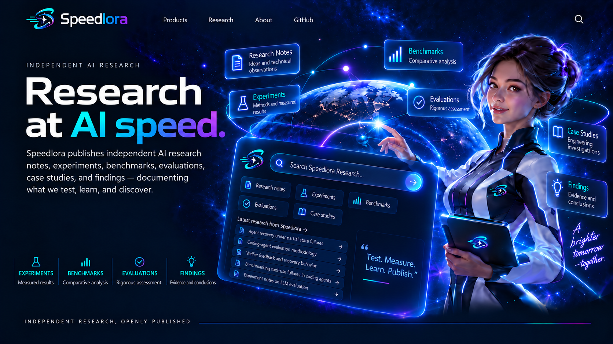

# Speedlora™

  

  <strong>Research at AI speed.</strong>

Speedlora is an AI-powered research and discovery platform designed to accelerate how people explore, understand, connect, and transform knowledge into action.

  

---

## Official websites

The following domains are official Speedlora properties:

- https://speedlora.app
- https://speedlora.com
- https://speedlora.com.br

---

## About Speedlora

Speedlora combines artificial intelligence, research, knowledge discovery, and intelligent exploration to help people move from questions to insights — faster.

The platform is being designed around the idea that AI should not only generate answers, but help users research, explore, compare, understand, connect information, identify patterns, and transform knowledge into action.

Speedlora is focused on creating faster and more intelligent workflows for research, discovery, learning, and knowledge-driven work.

---

## Brand identity

The Speedlora visual identity includes its:

- Speedlora™ name
- logo and symbol
- visual identity
- color system
- slogans and taglines
- interface concepts
- illustrations
- characters
- associated brand assets

Official brand materials are maintained in the [`/brand`](./brand) directory.

---

## Trademark notice

**Speedlora™** is a brand created and used by **Fernando Humel Procópio**.

The Speedlora name, logo, symbol, visual identity, slogans, characters, and associated brand assets are proprietary brand identifiers.

Publication of this repository does not grant any right, license, or permission to use the Speedlora name, logo, visual identity, characters, or other brand assets in connection with any product, service, website, application, company, or organization.

No trademark rights are granted by implication or otherwise.

Speedlora™ is not represented here as a registered trademark unless and until an applicable trademark registration is obtained.

---

## Copyright and licensing

Unless expressly stated otherwise:

**© 2026 Fernando Humel Procópio. All rights reserved.**

This repository is proprietary.

No permission is granted to copy, modify, distribute, sublicense, commercially exploit, or create derivative works from the original source code, documentation, visual assets, branding, illustrations, characters, or other original materials contained in this repository without prior written permission.

See:

- [`LICENSE`](./LICENSE)
- [`TRADEMARK.md`](./TRADEMARK.md)

---

## Official repository

This repository serves as the public development and brand-history repository for Speedlora™.

Brand assets, documentation, product concepts, and releases maintained here may be versioned over time as the Speedlora platform evolves.

---

**Speedlora™ — Research at AI speed.**
